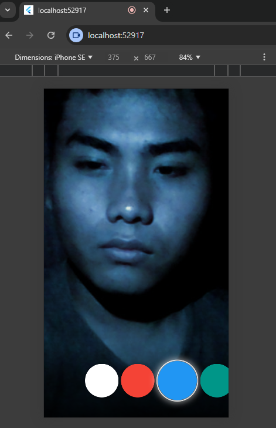
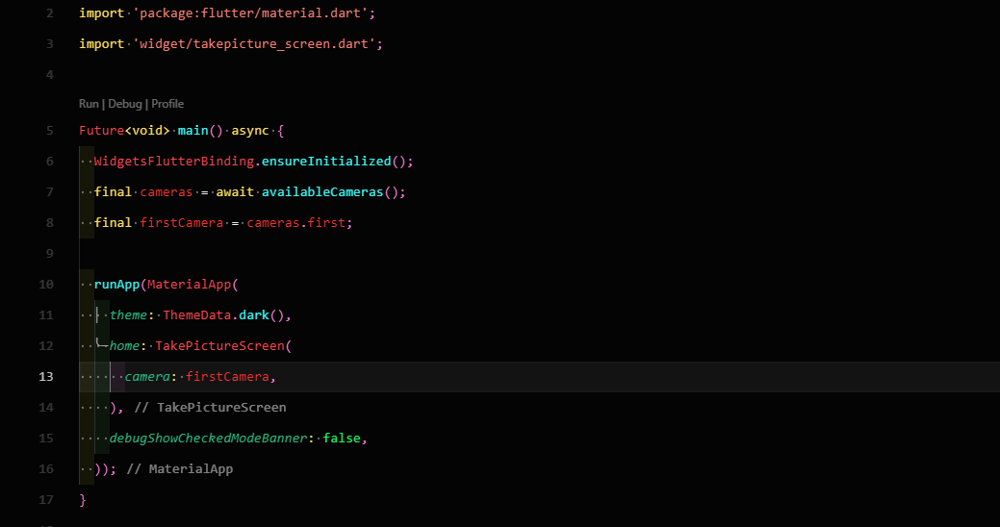
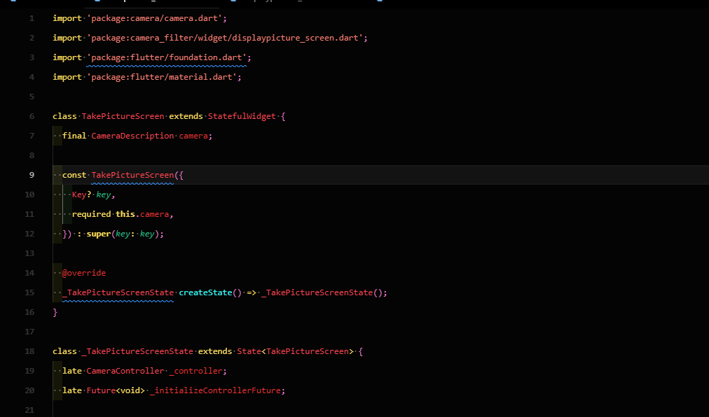
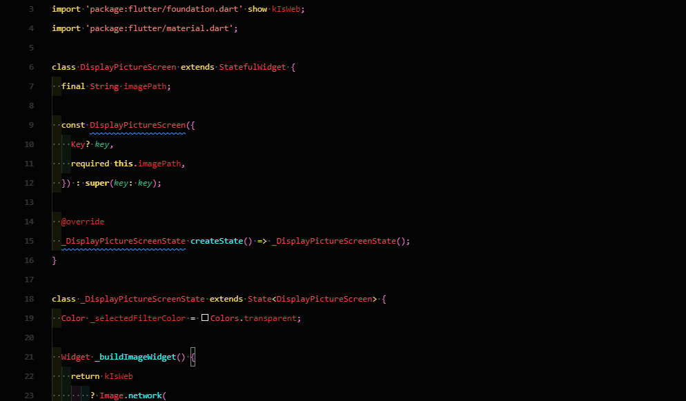
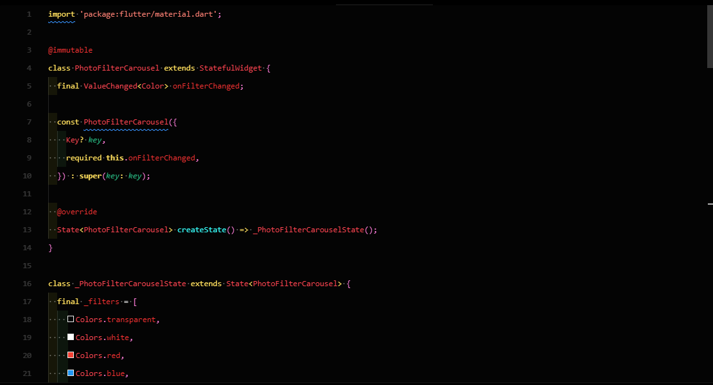

gambar di atas merupakan filter yang setelah di ambil gambar pada

take picture dan kemudian memilih filter
dab untuk code emua nya ada di bawah ini

code di atas merupakan code main yang menjalan kan semua perintah nya

code di atas merupakan fngsi untuk mengambil gambar atau takepicture

code di atas merupakan display picture yang berfungsi untuk mengatur layar yang akan di gunakan filter nya

code di atas merupakan code pengaturan filter nya dan di dalam code tersebut saya menggabungkan item warna dan lain nya 
dan tidak pakai inheret